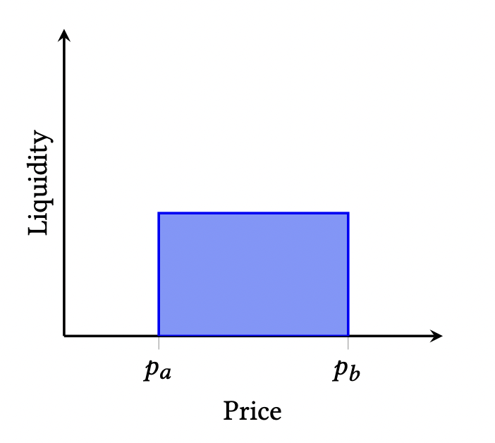

# v1-lbp

Marginal v1 liquidity bootstrapping pool smart contracts.

## Mechanism

Uniswap v3 range position in a single pool with fixed upper and lower ticks set by liquidity bootstrapping pool supplier.



The Marginal v1 liquidity bootstrapping pool starts at one end of the tick range with supplier providing tokens
in only one type of token (e.g. all in `token0` if start at `tickLower`). Buyers bid by swapping through the pool
for supplied token in exchange for token supplier is looking to acquire funds in.

Once price reaches the upper tick, the pool will contain only the acquired funds token. These funds are sent
back to the original supplier who may use them coupled with more token to seed full range liquidity pools.

## Installation

The repo uses [ApeWorX](https://github.com/apeworx/ape) for development.

Set up a virtual environment

```sh
python -m venv .venv
source .venv/bin/activate
```

Install requirements and Ape plugins

```sh
pip install -r requirements.txt
ape plugins install .
```

## Tests

Tests without fuzzing

```sh
ape test -s -m "not fuzzing"
```

Tests with fuzzing

```sh
ape test -s -m "fuzzing"
```
